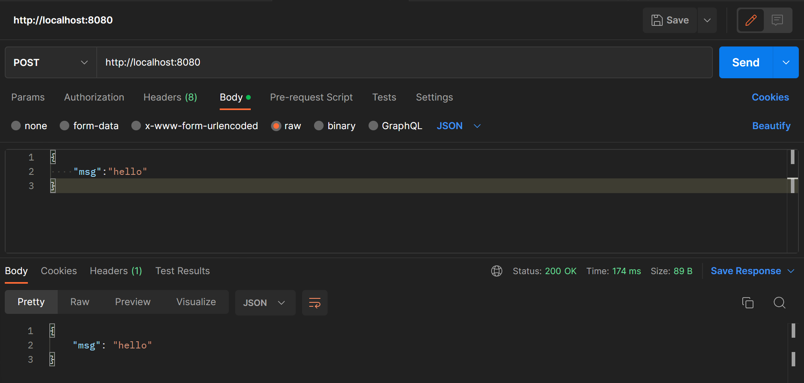
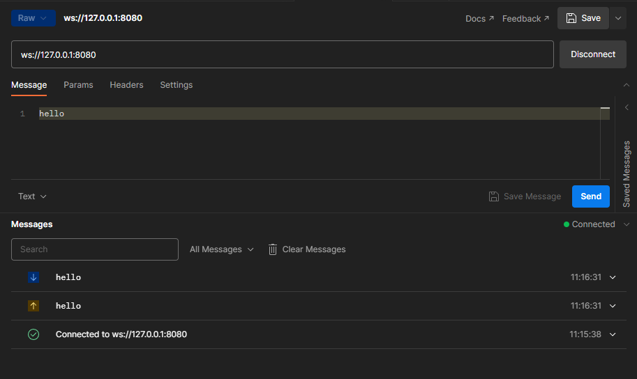

# http-flink说明
实现了http协议的一个基于flink的框架，方便其他系统在不使用消息队列的情况下调用flink程序。

## 框架现状
* http 暂时只支持post方法，json方式传参

## 使用入门
**由于框架暂未发布到maven，需要使用者把源码下载下来后自行打包并发布到本地的maven仓库中。发布好后可以通过以下依赖引入到项目中。**

### <a name="基于http调用">基于http调用</a>

```xml
~~~
<!-- flink依赖包 -->
<dependency>
    <groupId>org.apache.flink</groupId>
    <artifactId>flink-java</artifactId>
    <version>1.14.3</version>
</dependency>
<dependency>
    <groupId>org.apache.flink</groupId>
    <artifactId>flink-streaming-java_2.11</artifactId>
    <version>1.14.3</version>
</dependency>
<dependency>
    <groupId>org.apache.flink</groupId>
    <artifactId>flink-clients_2.11</artifactId>
    <version>1.14.3</version>
</dependency>
<!-- http连接方式 -->
<dependency>
    <groupId>org.jjy</groupId>
    <artifactId>netty-common</artifactId>
    <version>0.0.1</version>
</dependency>
~~~
```

创建一个类包含如下代码，代码实现了一个监听8080端口的web服务

```java
~~~
public static void main(String[] args) throws Exception {
    //创建运行环境
    final StreamExecutionEnvironment env = StreamExecutionEnvironment.getExecutionEnvironment();
    DataStream<HttpDto<String>> source = env.addSource(new HttpSource(8080));
    source.print("hello");
    source.addSink(new HttpSink());
    env.execute("HelloWorld");
}
~~~
```

好了，现在让我们使用postman来测试一下我们的代码吧！



### 基于WebSocket调用

环境依赖可以参考<a href="#基于http调用">基于http调用</a>

创建一个类包含如下代码，代码实现了一个监听8080端口的web服务，并且支持webSocket

```java
~~~
public static void main(String[] args) throws Exception {
    //创建运行环境
    final StreamExecutionEnvironment env = StreamExecutionEnvironment.getExecutionEnvironment();
    DataStream<HttpDto<String>> source = env.addSource(new HttpSource(8080));
    source.print("hello");
    source.addSink(new WebSocketSink());
    env.execute("HelloWorld");
}
~~~
```

现在，我们可以使用postman来测试我们的webSocket了

**webSocket需要使用登录过的postman**

